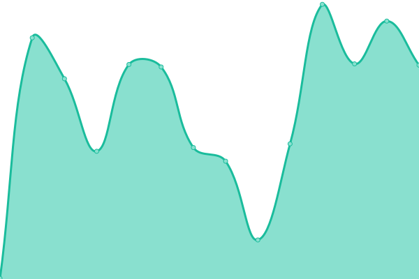

# [📈 Live Status](https://status.phazed.xyz): <!--live status--> **🟩 All systems operational**

This repository contains the open-source uptime monitor and status page for [Upptime](https://upptime.js.org), powered by [Upptime](https://github.com/upptime/upptime).

With [Upptime](https://upptime.js.org), you can get your own unlimited and free uptime monitor and status page, powered entirely by a GitHub repository. We use [Issues](https://github.com/upptime/upptime/issues) as incident reports, [Actions](https://github.com/phaze-the-dumb/statuspage/actions) as uptime monitors, and [Pages](https://status.phazed.xyz) for the status page.

<!--start: status pages-->
<!-- This summary is generated by Upptime (https://github.com/upptime/upptime) -->
<!-- Do not edit this manually, your changes will be overwritten -->
<!-- prettier-ignore -->
| URL | Status | History | Response Time | Uptime |
| --- | ------ | ------- | ------------- | ------ |
|  [Proxy Server](https://dns.phazed.xyz) | 🟩 Up | [proxy-server.yml](https://github.com/phaze-the-dumb/statuspage/commits/HEAD/history/proxy-server.yml) | 

 190ms
     
 | 

<a href="https://status.phazed.xyz/history/proxy-server">100.00%</a>
    

|  [CDN](https://cdn.phazed.xyz/F1G3SQaaMAAWBI9t.jpg) | 🟩 Up | [cdn.yml](https://github.com/phaze-the-dumb/statuspage/commits/HEAD/history/cdn.yml) | 

 230ms
     
 | 

<a href="https://status.phazed.xyz/history/cdn">100.00%</a>
    

|  [File Sea](https://webstatic-sea.phazed.xyz) | 🟩 Up | [file-sea.yml](https://github.com/phaze-the-dumb/statuspage/commits/HEAD/history/file-sea.yml) | 

 264ms
     
 | 

<a href="https://status.phazed.xyz/history/file-sea">100.00%</a>
    

|  [Phaze ID](https://id.phazed.xyz) | 🟩 Up | [phaze-id.yml](https://github.com/phaze-the-dumb/statuspage/commits/HEAD/history/phaze-id.yml) | 

 195ms
     
 | 

<a href="https://status.phazed.xyz/history/phaze-id">100.00%</a>
    

|  [Photo Backups](https://photos.phazed.xyz/api/v1/status) | 🟩 Up | [photo-backups.yml](https://github.com/phaze-the-dumb/statuspage/commits/HEAD/history/photo-backups.yml) | 

 499ms
     
 | 

<a href="https://status.phazed.xyz/history/photo-backups">100.00%</a>
    

<!--end: status pages-->

[**Visit our status website →**](https://status.phazed.xyz)

## 📄 License

- Powered by: [Upptime](https://github.com/upptime/upptime)
- Code: [MIT](./LICENSE) © [Upptime](https://upptime.js.org)
- Data in the `./history` directory: [Open Database License](https://opendatacommons.org/licenses/odbl/1-0/)
